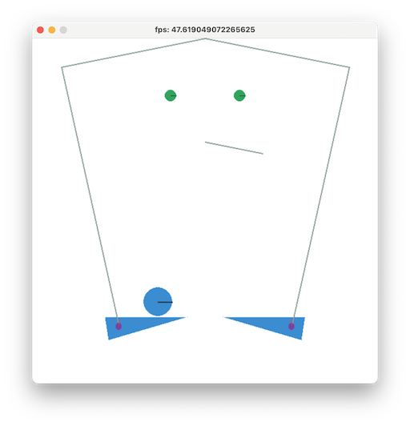

# pyxelとpymunkでpinball
pymunkのexsampleのflipper.pyをpyxelで動くようにしました。  

pymunkのexampleのflipper.pyを動かすとこんな画面  


これをpyxelで動くようにしたものが  


## Web化チャレンジ２（まだエラーが出てる：pymunkが定義されてないとなる）
- [this Web](https://sanbunno-ichi.github.io/pinball/)

folder構成  
```
pyxel_flipper_web
- pyxel_flipper.py  
- web_test.py  
```
pyxel_flipper_web下で、「pyxel package . web_test.py」を実行して、pyxel_flipper_web.pyxappを作成  
index.htmlを編集して置いた  
  
## Web化（あとで確認：FC2ではエラーになって起動できず）
- [FC2 WEB](https://sanbunnoichi1962.web.fc2.com/pyxel/pyxel_flipper.html)

## 更新履歴
2024.12.28 pyxel_pinball公開

